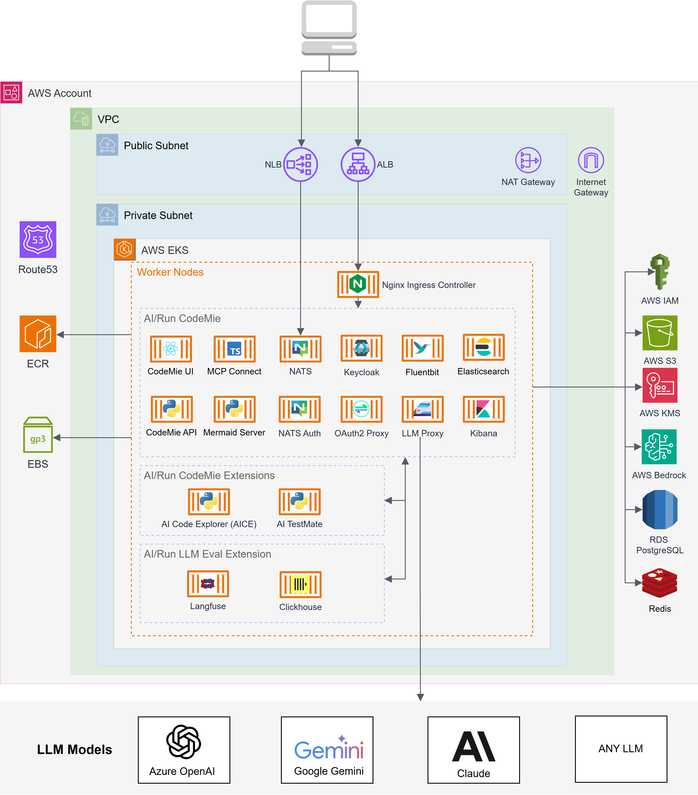
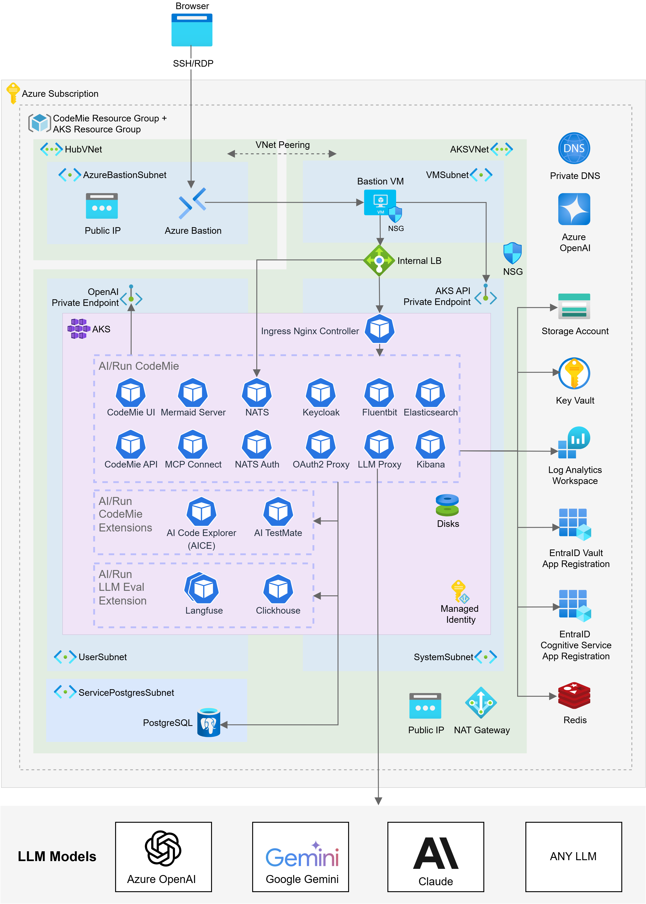

import Tabs from '@theme/Tabs';
import TabItem from '@theme/TabItem';
import ContainerResources from '../common/deployment/architecture/_container-resources.mdx';

# Kubernetes Deployment Architecture

This page describes the full production deployment architecture on a managed Kubernetes cluster. A cloud provider can be selected below for provider-specific details.

<Tabs groupId="cloud-provider">
<TabItem value="aws" label="AWS">

AI/Run CodeMie is deployed on Amazon Elastic Kubernetes Service (EKS) with supporting AWS services for networking, storage, and identity management.

### High-Level Architecture Diagram

The diagram below illustrates the complete AI/Run CodeMie infrastructure deployment on AWS:

</TabItem>
<TabItem value="azure" label="Azure">

AI/Run CodeMie is deployed on Azure Kubernetes Service (AKS) with supporting Azure services for networking, storage, and identity management.

### High-Level Architecture Diagram

The diagram below illustrates the complete AI/Run CodeMie infrastructure deployment on Azure:

</TabItem>
<TabItem value="gcp" label="GCP">

AI/Run CodeMie is deployed on Google Kubernetes Engine (GKE) with supporting GCP services for networking, storage, and identity management.

### Deployment Options

There are two deployment options available depending on your organization's access requirements:

- **Public cluster option** - Access to AI/Run CodeMie from predefined networks or IP addresses (VPN, corporate networks, etc.) using public DNS resolution from user workstations
- **Private cluster option** - Access to AI/Run CodeMie via Bastion host using private DNS resolution for enhanced security

### High-Level Architecture Diagram

The diagram below illustrates the complete AI/Run CodeMie infrastructure deployment on GCP:

</TabItem>
</Tabs>

:::tip Architecture Customization
The architecture can be customized based on your organization's security policies, compliance requirements, and operational preferences. Consult with your deployment team to discuss specific requirements.
:::

## Kubernetes Resource Requirements

<ContainerResources />
